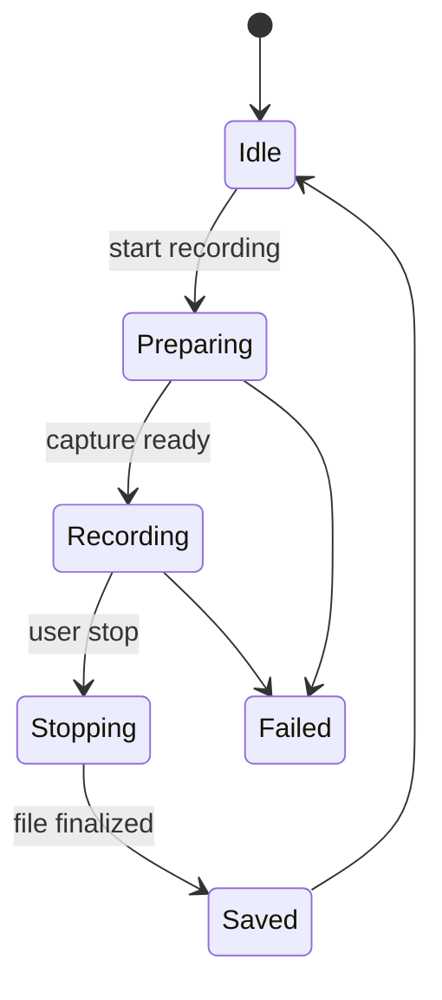
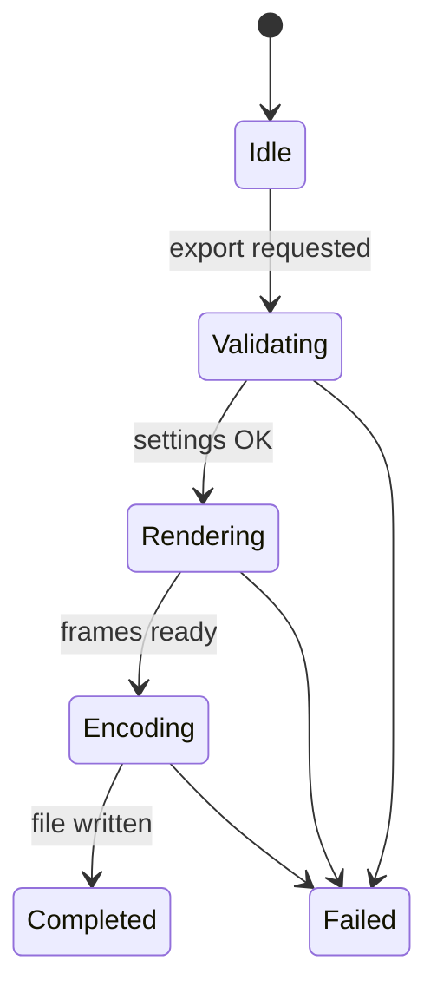

# SaneVideo Architecture

Last updated: 2026-02-02

## Purpose

SaneVideo is a native macOS app for recording, editing, and exporting video. It combines screen/camera capture, timeline editing, and export tooling in a single local-first app.

## Non-goals

- No cloud sync for projects by default.
- No Intel support (Apple Silicon only).
- No reliance on third-party web services for core editing.

## System Context

- **Capture**: AVFoundation + ScreenCaptureKit.
- **Rendering**: Metal/Core Image for real-time effects.
- **AI features**: On-device frameworks (FoundationModels/Core ML).
- **Updates**: Sparkle appcast (configured in Info.plist).
- **No GitHub DMG**: DMGs are hosted on Cloudflare R2, not in GitHub.

## Architecture Principles

- Strict modularity (small, focused files).
- Concurrency via actors and async/await.
- Protocol-driven services with dependency injection.
- UI is state-driven; business logic lives in services.

## Core Components

| Component | Responsibility | Key Files |
|---|---|---|
| AppState | Global coordinator for UI state | `State/AppState.swift` |
| RecordingEngine | Screen/camera recording pipeline | `Services/Recording/*` |
| ExportEngine | Render and encode exports | `Services/Export/*` |
| Timeline Services | Timeline model + operations | `Services/Timeline/*` |
| ProjectStore | File-based persistence for projects | `Services/Project/ProjectStore.swift` |
| TemplateStore | Export template storage | `Services/Project/TemplateStore.swift` |
| UpdaterService | Sparkle updater wrapper | `Services/Update/UpdaterService.swift` |

## Data and Persistence

- **Projects**: `~/Movies/SaneVideo/Projects/*.svproj` (fallback to Documents or temp when unavailable).
- **Recordings**: `~/Movies/SaneVideo/Recordings/`.
- **Templates**: `~/Movies/SaneVideo/Templates/*.svtemplate`.
- **Exports**: Defaults to `~/Desktop/` (user configurable).

## Key Flows

### Recording Lifecycle
1. User starts recording (menu bar or hotkey).
2. RecordingEngine configures capture inputs.
3. Frames/audio are written to a recording file.
4. Recording stops; output is saved to Recordings.
5. ProjectStore registers the new media.

### Editing and Timeline
1. User imports media into a project.
2. Timeline services manage clip order, trims, and edits.
3. UI reflects timeline state via AppState bindings.

### Export
1. User selects export settings and destination.
2. ExportEngine renders and encodes output.
3. Progress updates surface in UI.
4. Completed export is saved to disk.

## State Machines

### Recording State

| State | Meaning | Entry | Exit |
|---|---|---|---|
| Idle | Not recording | default | start |
| Preparing | Configure capture | start request | ready/fail |
| Recording | Actively capturing | capture start | stop/fail |
| Stopping | Finalize file | stop request | saved/fail |
| Saved | Recording written | finalize | idle |
| Failed | Error captured | error | idle |

### Export Pipeline

| State | Meaning | Entry | Exit |
|---|---|---|---|
| Idle | No export in progress | default | export |
| Validating | Validate settings + paths | export request | render/fail |
| Rendering | Render timeline | ExportEngine | encode/fail |
| Encoding | Encode output | ExportEngine | completed/fail |
| Completed | Export saved | finalize | idle |
| Failed | Export failed | error | idle |

## Permissions and Privacy

- Camera, Microphone, and Screen Recording are required for capture.
- Processing is local-only; no telemetry.
- Sparkle update checks contact the configured appcast URL only.

## Build and Release Truth

- **Single source of truth**: `.saneprocess` in the project root.
- **Build/test**: `./Scripts/SaneMaster.rb verify` (no raw xcodebuild).
- **Release**: `./Scripts/SaneMaster.rb release` (delegates to SaneProcess `release.sh`).
- **DMGs**: uploaded to Cloudflare R2 (not committed to GitHub).
- **Appcast**: Sparkle feed configured in `SaneVideo/Info.plist`.

## Testing Strategy

- Unit tests in `SaneVideoTests/`.
- Use `./Scripts/SaneMaster.rb verify` (and `gen_assets` for media fixtures).

## Risks and Tradeoffs

- High performance demands from real-time recording and effects.
- Large media files can stress disk and memory.
- Screen capture permissions can fail silently if not granted.
