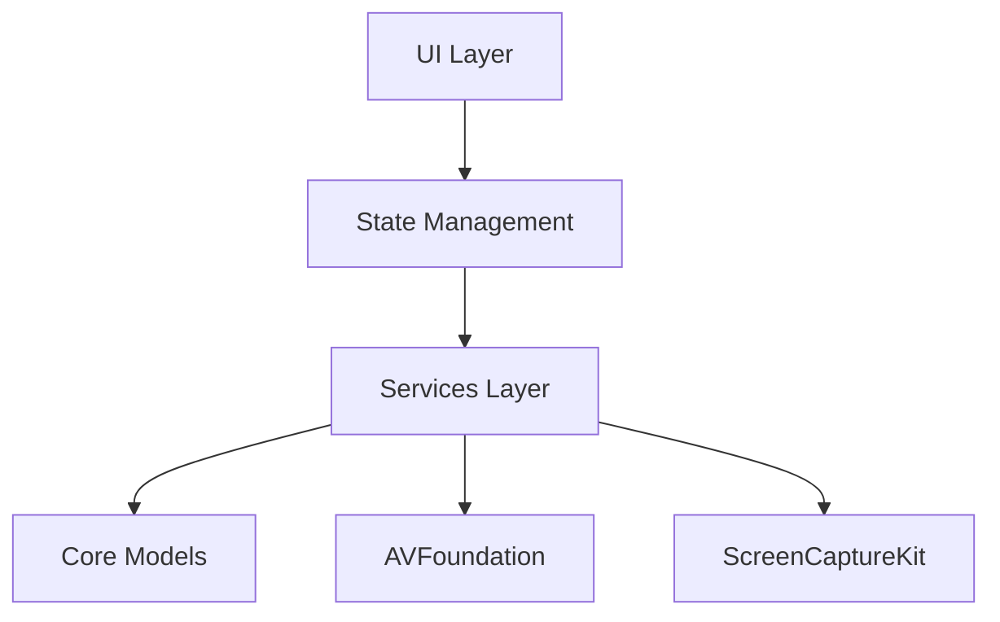
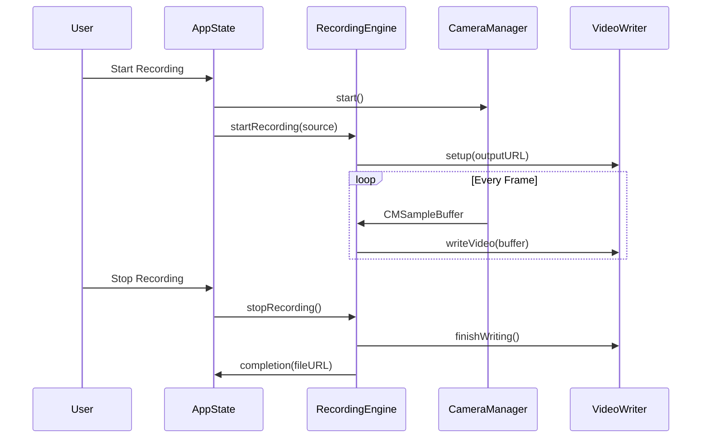
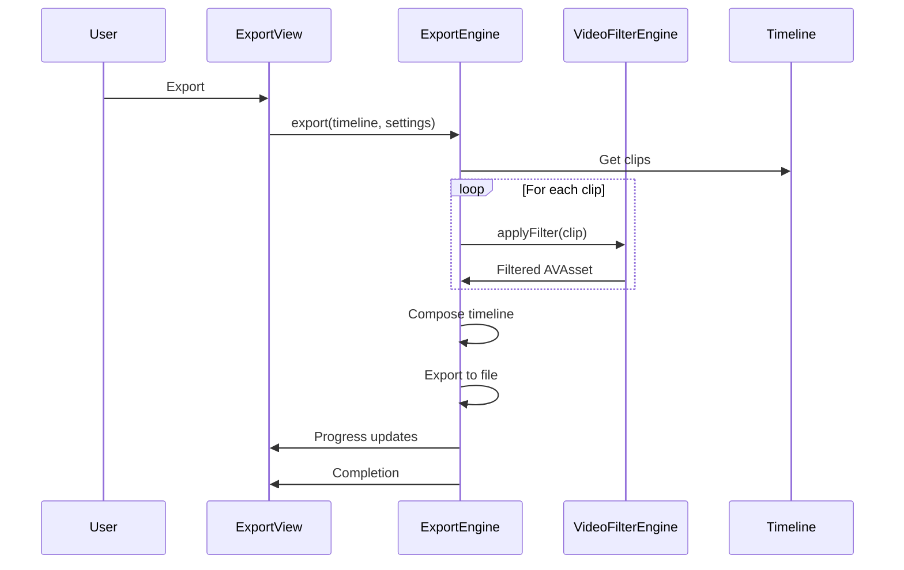

# SaneVideo Architecture

AI-friendly architecture overview for SaneVideo video editing application.

## High-Level Architecture



## Directory Structure

```
SaneVideo/
├── Core/               # Foundation types
│   ├── Models/        # Domain models (VideoProject, Timeline, VideoClip)
│   ├── Protocols/     # Service protocols for DI
│   ├── Utilities/     # Shared utilities (TimecodeFormatter)
│   ├── AppError.swift # Unified error handling
│   └── AppLogger.swift# Centralized logging
├── Services/          # Business logic
│   ├── Camera/       # Camera capture (CameraManager)
│   ├── Recording/    # Recording engine (RecordingEngine)
│   ├── Export/       # Export engine (ExportEngine)
│   ├── Project/      # Persistence (ProjectStore)
│   └── Filter/       # Video filters (VideoFilterEngine)
├── State/            # App state management
│   └── AppState.swift# Main app state coordinator
└── UI/               # SwiftUI views
    ├── Views/        # Main views
    ├── Windows/      # Custom windows (FloatingControls, PiP)
    └── Components/   # Reusable components
```

## Core Components

### Models Layer

**VideoProject** - Root entity containing timeline and metadata  
**Timeline** - Ordered collection of video clips with playback state  
**VideoClip** - Individual video with trim and filter settings  
**RecordingModels** - Enums for filters, modes, export settings

All models are:

- `Codable` for persistence
- `ObservableObject` for SwiftUI reactivity
- Single-responsibility focused

### Services Layer

**CameraManager** - AVCapture session lifecycle, permission handling  
**RecordingEngine** - Coordinates camera/screen recording, manages sources  
**ExportEngine** - Composes timeline, manages export to file  
**VideoFilterEngine** - Applies Core Image filters to video  
**ProjectStore** - File-based JSON persistence for projects

Services follow protocols for testability and DI.

### State Management

**AppState** - Main coordinator (@MainActor)

- Owns current project
- Coordinates recording lifecycle  
- Manages UI state (recording, paused, filters)

**Data Flow:**

```
User Action → AppState → Service → Model Update → UI Refresh
```

## Recording Pipeline



## Export Pipeline



## Concurrency Model

- **@MainActor**: AppState, all ObservableObjects, UI updates
- **Background queues**: AVFoundation operations, file I/O
- **Swift Concurrency**: Prefer async/await over completion handlers

## Error Handling

Centralized through `AppError` enum:

- Camera errors → User gets permission dialog hint
- Recording errors → Stop recording, save partial file
- Export errors → Show error with recovery suggestion

All errors logged via `AppLogger` with appropriate category.

## Logging Categories

```swift
AppLogger.camera      // AVCapture operations
AppLogger.recording   // Recording lifecycle
AppLogger.export      // Export operations  
AppLogger.timeline    // Timeline edits
AppLogger.project     // Persistence
AppLogger.ui          // UI events
AppLogger.general     // Everything else
```

## Design Patterns

- **MVVM**: Views → ViewModels → Services → Models
- **Protocol-oriented**: Service protocols for DI
- **Observer**: Combine publishers for reactive updates
- **Coordinator**: AppState coordinates subsystems
- **Repository**: ProjectStore abstracts persistence

## Key Constraints

- **File size**: Max 500 lines (enforced by health check)
- **SwiftUI**: Pure SwiftUI for UI, AppKit for windows
- **macOS only**: Uses ScreenCaptureKit, AVFoundation
- **No external deps**: Pure Swift/Apple frameworks

## Testing Strategy

- **Unit**: Mock services via protocols
- **Integration**: Test flows with real AVFoundation
- **UI**: SwiftUI previews with mock data

## AI Development Guidelines

1. **Find code**: Use feature-based directory (Camera → Services/Camera/)
2. **File size**: Never exceed 500 lines (run health check)
3. **Protocols first**: Define interface before implementation
4. **Build often**: Verify after each meaningful change
5. **Error handling**: Use AppError, not strings
6. **Logging**: Use appropriate AppLogger category
